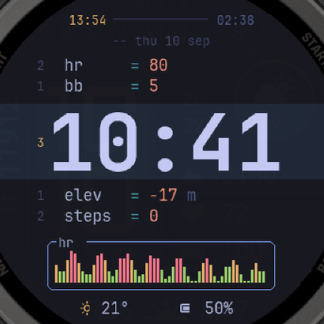

# OmaWatch

A Garmin watch face in the style of a tiling Linux desktop. Two layouts, a
code-editor look, and the colour schemes of the Omarchy desktop.



## Layouts

- **Neovim.** Your values as code rows (`hr = 54`) around a cursor line that
  holds the time. A graph in a box at the bottom, like btop.
- **Waybar.** A bar across the top with the weekday as workspace numbers.
  The bottom edge of the bar fills with the value you choose for the top bar.

## Features

- 22 colour schemes: Tokyo Night, Catppuccin, Gruvbox, Everforest, Nord and
  more.
- Four rows you can set, from 31 values: heart rate, body battery, elevation,
  steps, temperature, watch battery, floors, stress, step goal percentage,
  steps with the goal, floors with the goal, active minutes with the goal,
  VO2 max run and bike, weekly run and bike distance, pressure, calories,
  respiration rate, pulse ox, sleep score, recovery time, notifications, the
  four race time predictions, feels like, humidity, wind speed and rain
  chance.
- A top bar you can set: daylight from sunrise to sunset, step goal, floors
  goal, active minutes, body battery, watch battery, the day, stress, sleep
  score, pulse ox, or off.
- Temperature in the unit of the watch, or always in Celsius or Fahrenheit.
  Distance in the unit of the watch, or always in kilometres or miles.
- Two text sizes, normal and large.
- A graph of the last hours, from heart rate, body battery, elevation,
  pressure, stress, pulse ox or temperature.
- Always-on mode with dim digits that move every minute.
- Settings on the watch itself: hold MENU on the face and open its settings.
  No phone needed. The row values are in groups, so you find one quickly with
  the buttons.

## Requirements

- A round AMOLED Garmin watch with Connect IQ API 5.0 or newer. 47 models,
  from the Venu 2 to the Fenix 8.
- Temperature, the weather values and the sunrise and sunset times come from
  Garmin's weather data. The watch gets them from the phone, so they stay
  empty until the first sync.
- VO2 max, the weekly distances, the race predictions, the sleep score and
  the pressure come from Garmin complications. A value stays empty until the
  watch has enough data for it.

## Install

Get it from the Connect IQ Store, or build it yourself.

## Build

1. Install the Connect IQ SDK Manager, then the SDK and the devices you want.
2. Make a developer key:

   ```
   openssl genrsa -out developer_key.pem 4096
   openssl pkcs8 -topk8 -inform PEM -outform DER -in developer_key.pem -out developer_key -nocrypt
   ```

3. Build for one watch:

   ```
   monkeyc -f monkey.jungle -d instinct3amoled45mm -o bin/omawatch.prg -y developer_key -w -l 3
   ```

4. Run it in the simulator:

   ```
   tools/sim.sh bin/omawatch.prg instinct3amoled45mm
   ```

   On Arch the simulator needs `sdk/compat`, because Garmin builds it against
   webkit2gtk 4.0. The script sets that up. Without it, start the simulator
   with `connectiq &` and then run `monkeydo`.

To put it on a watch, copy the `.prg` file to `GARMIN/Apps` on the watch, then
disconnect the cable.

## Fonts

The face uses JetBrains Mono, converted to bitmap fonts with
`tools/mkfont.py`. To make every font for every screen size:

```
tools/genfonts.sh
```

There are two sizes of the text fonts, for the text size setting. Only the
pair the watch needs is loaded. The row and small fonts hold the Latin, Greek
and Cyrillic alphabets, 431 glyphs each. The watch gives the date in its own language, and a letter that
is not in the font is drawn as nothing, so the fonts must cover every
language the watch can be set to. The big font shows the time, so it holds
only the digits and a colon.

JetBrains Mono is licensed under the SIL Open Font License 1.1. See
`docs/OFL.txt`.

## Layout grid

Every layout is drawn on a 390 x 390 grid and scaled to the screen with
`Draw.p()`. Each screen size has its own font set in
`resources-round-<size>x<size>/fonts`.

## Licence

MIT. See `LICENSE`.

This project is not connected to Garmin, and not connected to the Omarchy
project.
